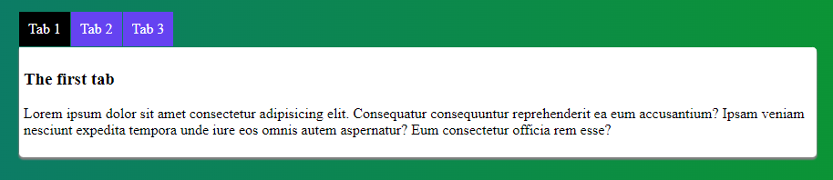

# Homework Assignments

## Description

There are 2 types of calculators included: 1 where you type in numbers and one where you click buttons. 

  
  

There are 2 apps that look the same, but are 2 methods for creating multi-tab SPA: with and without radio buttons. Both apps look like: 

